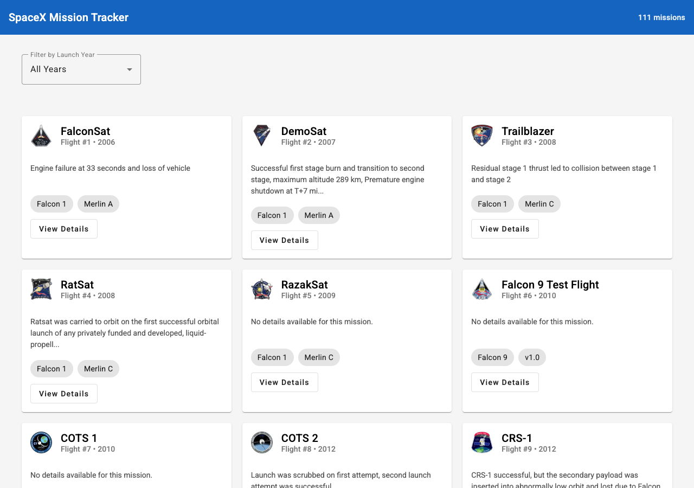
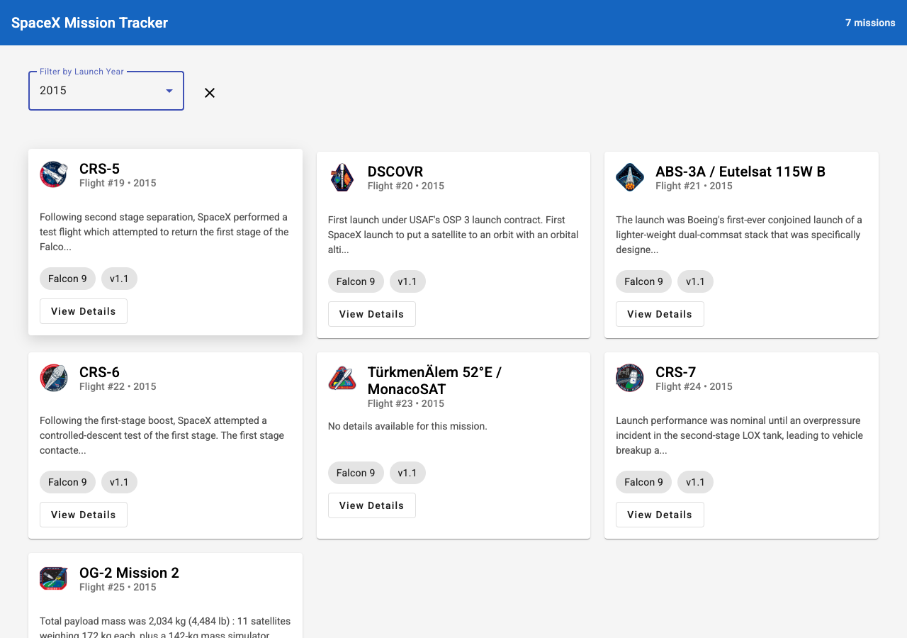
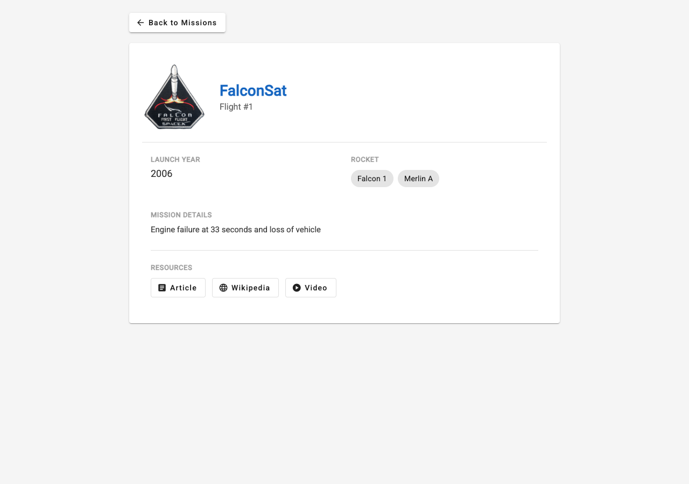

# 101533701 - Lab Test 2 - COMP3133

## SpaceX Mission Tracker

An Angular application that fetches and displays SpaceX mission data using the [SpaceX REST API](https://api.spacexdata.com/v3/launches).

## Features

- **Mission List** – Displays all SpaceX launches with flight number, mission name, launch year, details, rocket info, and mission patch image.
- **Filter by Year** – Dropdown filter to view missions from a specific launch year (2006–2025).
- **Mission Details** – Click any mission to view full details including links to articles, Wikipedia pages, and launch videos.
- **Angular Material UI** – Clean, responsive card-based layout using Angular Material components (cards, toolbar, chips, buttons, icons, spinner).
- **Angular Signals** – Reactive state management using Angular's built-in signal API.
- **Modern Angular syntax** – Uses `@for`, `@if`, `@switch` control flow blocks.

## Screenshots

### Mission List


### Filter by Year


### Mission Details


## Project Structure

```
src/app/
├── models/
│   └── mission.ts              # Mission, Rocket, Links interfaces
├── services/
│   └── spacex.service.ts       # HTTP service for SpaceX API
├── components/
│   ├── missionlist/            # Main list component
│   ├── missionfilter/          # Year filter component
│   └── missiondetails/         # Detail view component
├── app.config.ts               # App configuration (HttpClient, Router, Animations)
├── app.routes.ts               # Route definitions
├── app.ts                      # Root component
└── app.html                    # Root template
```

## API Endpoints Used

- `GET /v3/launches` – All launches
- `GET /v3/launches?launch_year={year}` – Filter by year
- `GET /v3/launches/{flight_number}` – Single launch details

## How to Run

```bash
# Install dependencies
npm install

# Start development server
ng serve

# Open browser at http://localhost:4200
```

## Technologies

- Angular 21
- Angular Material
- TypeScript
- SpaceX REST API v3
- RxJS HttpClient
